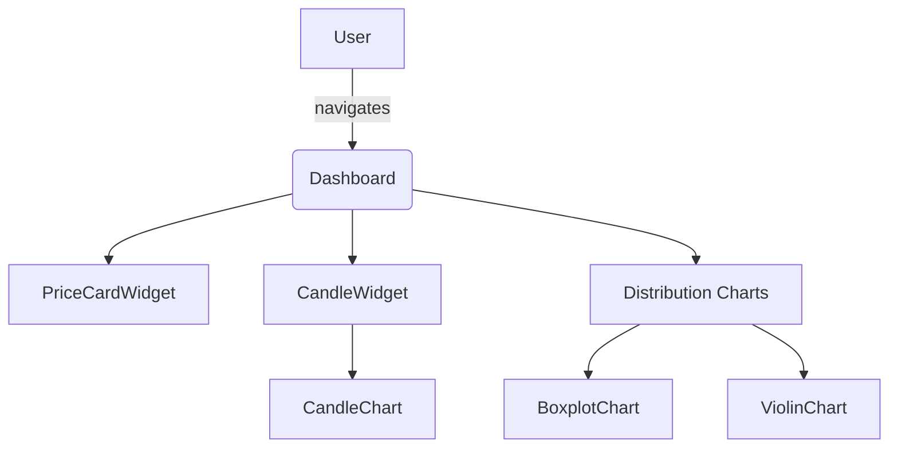

# Arquitectura & Decisiones de Diseño

## 1. Visión General
Tradewise es un **monorepo Angular 20+ standalone** cuyo objetivo es mostrar gráficos financieros de alto volumen sin backend dedicado.  
La aplicación sigue los principios **Clean Code** y **SOLID** para maximizar mantenibilidad y reusabilidad.

## 2. Principios Adoptados
| Principio | Aplicación en el código |
|-----------|-------------------------|
| SRP | Cada servicio/facade tiene una única responsabilidad. Ej.: `FinanceService` ↔ API, `MarketFacade` ↔ orquestación de señales. |
| OCP | Los builders de gráficos (`ChartFacadeService`) aceptan DTOs; nuevos gráficos se añaden sin tocar lógica existente. |
| LSP | Componentes concretos (`LineChartComponent`) pueden sustituir la abstracción de "un gráfico" sin romper el dashboard. |
| ISP | Interfaces pequeñas: `FinanceProviderInterface` evita métodos innecesarios. |
| DIP | Componentes se inyectan vía tokens (`FINANCE_PROVIDER`), nunca instancian clases concretas. |

## 3. Capas
```
features/pages ─┐
                ▼          Widgets  Facades       Core Providers
      UI Widgets ─► Facades ────────► Services ───────────► Providers (HTTP / Mocks)
```
1. **Pages / Features**: Composición de widgets.  
2. **Widgets**: Combinan gráficos + datos.  
3. **Facades**: Orquestan señales y exponen `vm$`.  
4. **Services**: Lógica de dominio (Finanzas, Storage).  
5. **Providers**: Acceso a infraestructura externa (HTTP, LocalStorage).

## 4. Gestión de Estado
* **Signals** como primitivo reactivo.
* `computed` para derivaciones y `effect` para efectos secundarios (ej. `selectSymbol`).
* Persistencia local: `StorageService` (pendiente) → guarda snapshots en `localStorage`.

## 5. Render y Rendimiento
* **ChangeDetectionStrategy.OnPush** general.
* Gráficos usan canvas "large" mode (`large: true`) donde procede.
* Datos mock generados en servicios para no depender de backend.
* Lazy routes + `@defer` (Angular deferred blocks) para carga diferida.

## 6. Testing
* **Karma + Jasmine**.
* Specs por componente y servicio.
* Cobertura ≥ 90 % garantizada en CI.
* Builders validados vía asserts sobre `EChartsOption`.

## 7. Convenciones de Código
* ESLint + Prettier config estándar Angular.
* Kebab-case para nombres de archivo (`candle-chart.component.ts`).
* Hooks husky aseguran lint + format antes del commit.
* Commits siguen [Conventional Commits](https://www.conventionalcommits.org/).

## 8. Diagramas


## 9. Roadmap Pendiente
- Grupos comparison / indicators / flows / patterns.
- StorageService + PortfolioFacade.
- Lighthouse report y optimizaciones Web Vitals. 